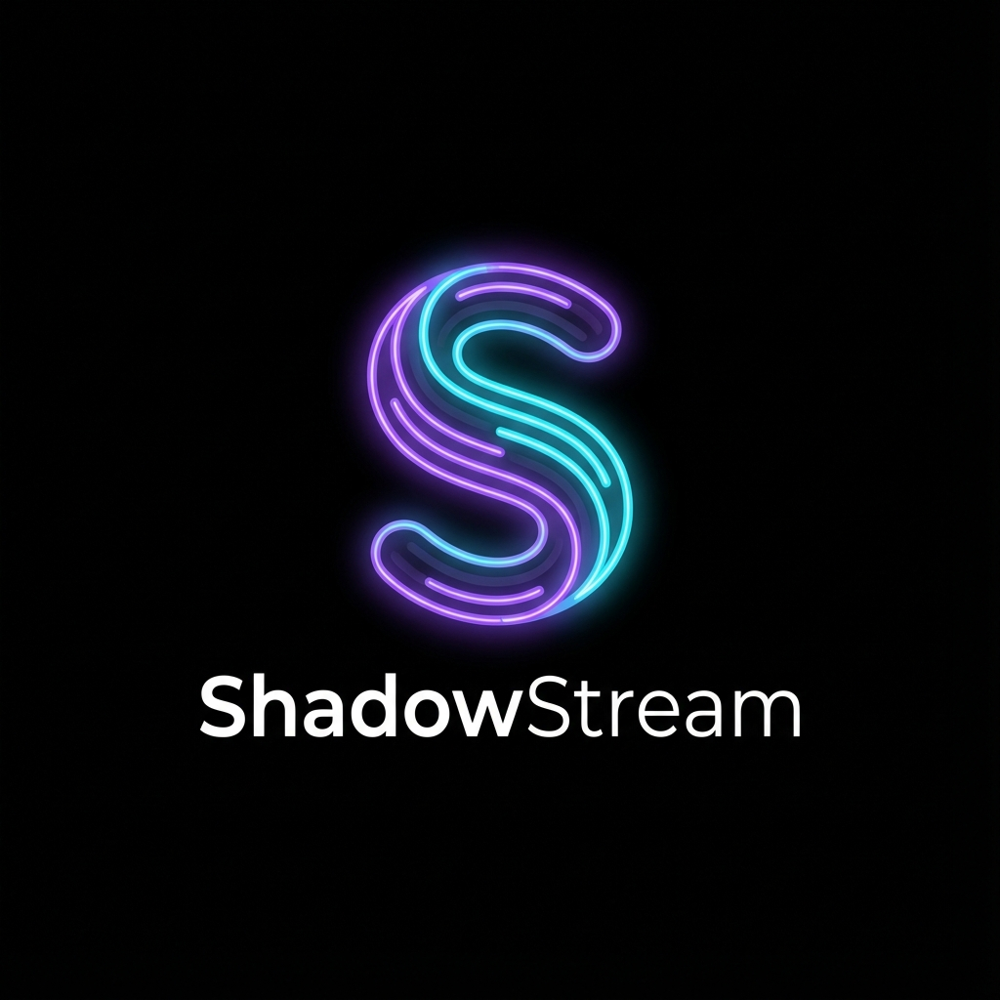

# ShadowStream

**Private Stablecoin Micropayments on Polygon**

ShadowStream is a Web3 platform enabling privacy-preserving, recurring micropayments using USDC/USDT on the Polygon Network. It allows users to create "Policy Vaults" with spending limits, enabling agents and AI services to spend on their behalf without exposing the user's main wallet keys.



## 🚀 Features

- **Gasless User Experience**: Users sign messages; the backend relayer handles gas fees.
- **Policy Vaults**: Smart contract wallets with `DailyLimit` and `MaxPerTx` controls.
- **Agentic Payments**: Dedicated keys for AI agents to execute payments within strict bounds.
- **Real-time Analytics**: Dashboard for tracking spend, active vaults, and merchant interactions.
- **Privacy**: Merchant interactions are decoupled from the user's main funding wallet.

---

## 🏗️ Project Structure

This is a monorepo containing:

- **`/web`**: React + Vite + Tailwind CSS frontend (Dashboard).
- **`/backend`**: Node.js + Express + Prisma backend (Relayer & API).
- **`/contracts`**: Hardhat + Solidity smart contracts.

---

## 📜 Deployed Contracts (Polygon Mainnet)

| Contract | Address | Explorer |
|----------|---------|----------|
| **PolicyVaultFactory** | `0x8704E52Db0a84CA2b9951e23104d01F9F0deFe0E` | [PolygonScan](https://polygonscan.com/address/0x8704E52Db0a84CA2b9951e23104d01F9F0deFe0E) |
| **MerchantRegistry** | `0x4B493f254a2Bd1FbBf66B5AfA4d02eAe208872b7` | [PolygonScan](https://polygonscan.com/address/0x4B493f254a2Bd1FbBf66B5AfA4d02eAe208872b7) |

---

## 🛠️ Deployment Guide

### 1. Backend Deployment (Render / Railway / Heroku)

The backend handles on-chain relaying and database operations.

**Recommended Host**: Render.com (Web Service)

**Build Command**: `npm install && npm run build` (inside `/backend`)
**Start Command**: `npm start`

**Environment Variables Required:**
| Variable | Description |
|----------|-------------|
| `DATABASE_URL` | PostgreSQL connection string (e.g. from Render/Neon/Supabase) |
| `DEPLOYER_PRIVATE_KEY` | Private key of the wallet paying gas for vault creation (Relayer) |
| `POLYGON_MAINNET_RPC_URL` | RPC Endpoint (e.g. `https://polygon-rpc.com`) |
| `NODE_ENV` | Set to `production` |
| `PORT` | `4000` (or allow host to set it) |

### 2. Frontend Deployment (Vercel)

The frontend is a React Single Page Application (SPA).

**Recommended Host**: Vercel

1. **Import Project**: Select the `web/shadowstream-dashboard-main` directory as the root.
2. **Framework Preset**: Vite
3. **Build Command**: `npm run build`
4. **Output Directory**: `dist`

**Environment Variables Required:**
| Variable | Description |
|----------|-------------|
| `VITE_API_URL` | The URL of your deployed Backend (e.g. `https://shadowstream-api.onrender.com`) |

> **Note**: A `vercel.json` is included to handle client-side routing rewrites.

---

## 💻 Local Development

1. **Clone & Install**
   ```bash
   git clone https://github.com/goat-dev8/shadow-stream.git
   cd shadow-stream
   npm install
   ```

2. **Database Setup**
   Ensure Postgres is running.
   ```bash
   cd backend
   npx prisma db push
   ```

3. **Start Backend**
   ```bash
   cd backend
   npm run dev
   ```

4. **Start Frontend**
   ```bash
   cd web/shadowstream-dashboard-main
   npm run dev
   ```

---

## 🛡️ Security

- **Private Keys**: The `DEPLOYER_PRIVATE_KEY` is critical. It controls the `PolicyVaultFactory`. Do not leak it.
- **Verification**: All contracts are verified on PolygonScan.

---

**Built with ❤️ by ShadowStream Team**
